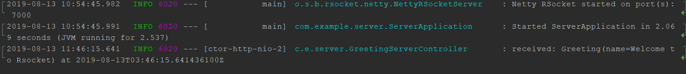

# Using RSocket with Spring Boot

[RSocket](https://rsocket.io) is a binary protocol for use on byte stream transports such as TCP, WebSockets, and Aeron.

It enables the following symmetric interaction models via async message passing over a single connection:

- request/response (stream of 1)
- request/stream (finite stream of many)
- fire-and-forget (no response)
- channel (bi-directional streams)

There are several implementations provided now, including Javascript, Java, Kotlin etc.  In this post, we will explore the official Java implementation- [rsocket-java](https://github.com/rsocket/rsocket-java), and later we will have a look at the RSocket integration provided in the latest Spring framework (and  Spring Boot).

The following example is showing  rsocket-java.

First of all, create a RSocket server and run it on localhost:7000.

```java
final AbstractRSocket responseHandler = new AbstractRSocket() {

            @Override
            public Mono<Payload> requestResponse(Payload payload) {
                log.info("received request-response payload: {}", 				payload.getDataUtf8());
                return Mono.just(DefaultPayload.create("received (" + payload.getDataUtf8() + ") at " + Instant.now()));
            }
        };

RSocketFactory.receive()
    .acceptor((setupPayload, reactiveSocket) -> Mono.just(responseHandler))
    .transport(TcpServerTransport.create("localhost", PORT))
    .start()
    .block();
```


In the above codes:

* The  `receive()` means it will receive the request from client.
* The `acceptor` defines how to process the request, it accept  a `SocketAcceptor`  class.  It is the place we can embed our handler for processing the incoming request.  `AbstractRSocket` is a convenient class which provides methods for all interactive models supported in RSocket. As an example,  here we only need to handle the **request/response**  model by overriding the `requestResponse`  method.
* The `transport`  specifies the server information, including host, port, protocol, etc. Here we use TCP as protocol,  and run it  on localhost at port 7000.

Next create a client to connect the existing server and send some data to it.

```java
RSocketFactory.connect()
                .transport(TcpClientTransport.create("localhost", PORT))
                .start()
                .flatMap(r -> r.requestResponse(DefaultPayload.create("Hello")))
                .subscribe(r -> log.info("handled result:#" + r.getDataUtf8()));
```


In the above codes:

* The `connect` indicates the current client will connect to server.
* The `transport` provides the server info which it will connect to.
* The `start` method returns a `RSocket`, it can be used to interact with server side.  Here we send a `requestResponse` type request, it requires a response from server.
* Finally,  we can  use `subcribe` to  display the received response from server.

Spring integrated RSocket into its messaging infrastructure, and it defines  a `RSocketStrategies ` to allow you encode and decode the RSocket payload via Jackson, besides a `RSocketRequester` is used to interact with the server side.

  

Using  [Spring initializr](https://start.spring.io),  you can generate a Spring Boot project skeleton in seconds.

* Project type: Maven
* Spring Boot:2.2.0.M5
* Project Metadata:
    * artifact : server
    * Options/Java : 11
* Dependencies: RSocket, Lombok

The generated codes are archived into a  zip file for downloading. Download and extract it into your favorite IDE. Open the *pom.xml*  in your IDE editor, there are two dependencies added.

```xml
<dependency>
    <groupId>org.springframework.boot</groupId>
    <artifactId>spring-boot-starter-rsocket</artifactId>
</dependency>

<dependency>
    <groupId>org.projectlombok</groupId>
    <artifactId>lombok</artifactId>
    <optional>true</optional>
</dependency>
```

The `spring-boot-starter-rsocket` includes auto-configurations for RSocket integration.  For the server side, it will create a Roscket server automatically from `RSocketProperties`.  For example, we defines the server info in the *application.properties*.

```pro
spring.rsocket.server.port=7000
spring.rsocket.server.transport=tcp
```

Start the application in IDE  or run `mvn spring-boot:run`,  you will see the server is running at localhost:7000.


Create a messaging controller . 

```java
@Controller
@Slf4j
class GreetingServerController {

    @MessageMapping("hello")
    public Mono<Void> hello(Greeting p) {
        log.info("received: {} at {}", p, Instant.now());
        return Mono.empty();
    }
    
}

@Data
class Greeting {
    String name;
}
```


It accepts a `Greeting` payload, return an `Mono.empty`.   Let's  create a client application to shake hands with it. Similarly generate it  via  [Spring initializr](https://start.spring.io).

* Project type: Maven
* Spring Boot:2.2.0.M5
* Project Metadata:
    * artifact : client
    * Options/Java : 11
* Dependencies: RSocket, Reactive Web, Lombok

An extra `spring-boot-starter-webflux` is added because this client  is a reactive web application, and it will run at port 8080.  

 Declare a `RSocketRequester`  bean firstly.  We use `RSocketRequester` to interact the RSocket at port 7000.

```java
@Bean
public RSocketRequester rSocketRequester(RSocketRequester.Builder b) {
    return b.connectTcp("localhost", 7000).block();
}
```

Create a `@RestController` to send a greeting message to the server side.

```java
@RestController
@RequiredArgsConstructor
class GreetingController {

    private final RSocketRequester requester;

    @GetMapping
    Mono<Void> hello() {
        return this.requester.route("hello").data(new Greeting("Welcome to Rsocket")).send();
    }

}

@Data
@AllArgsConstructor
class Greeting {
    String name;
}

```

Start the client and server respectively.   And try to  access `http://localhost:8080` by `curl` .

```bash
curl http://localhost:8080
```

In the output console of the server application, you can see the information like the following.



As you see, the sent message is received.

Check the source codes from  [Github](https://github.com/hantsy/rsocket-sample).

